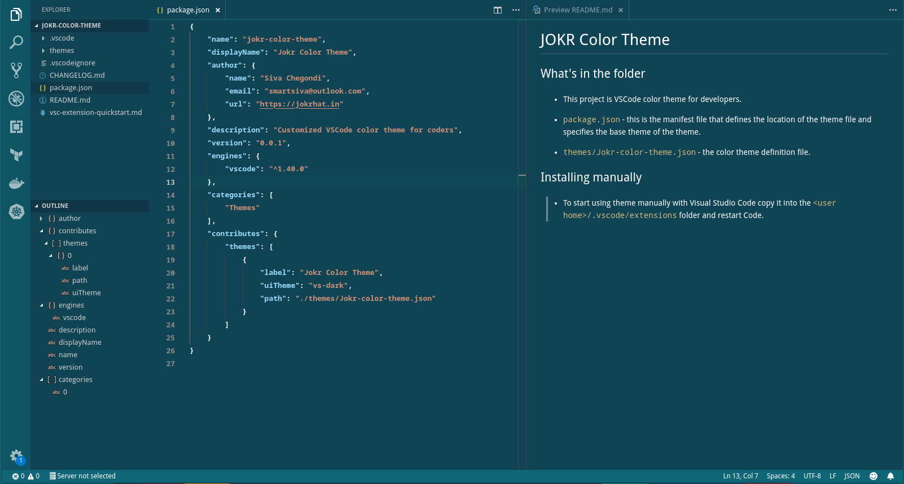

# JOKR Color Theme

## What's in the folder

* This project is VSCode color theme for developers.

* `package.json` - this is the manifest file that defines the location of the theme file and specifies the base theme of the theme.
* `themes/Jokr-color-theme.json` - the color theme definition file.

## Installing

### In Editor
* In Visual Studio Code, search as `Jokr`, you will find one and only one extension, thats ours ;)
* Additionally, you can also install from VSCode command line ( Ctrl + P )
```
ext install Jokr7.jokr-color-theme
```
### Manually

 To start using theme manually with Visual Studio Code copy it into the `<user home>/.vscode/extensions` folder and restart Code.

## Screenshot



## Contributing

Following is the GitHub URL, you can raise pull request along with Screenshot to enhance our theme.

[Jokr Color Theme (Git)](https://github.com/siva-chegondi/jokr-color-theme)
